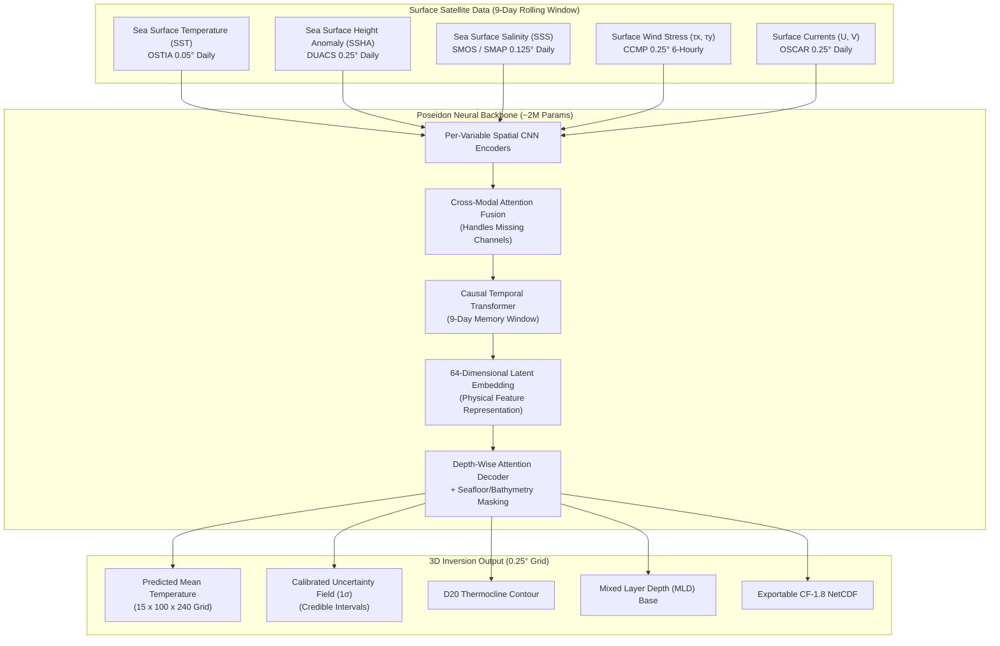

<div align="center">

# 🌊 POSEIDON
### Deep Ocean Subsurface Intelligence & 3D Neural Inversion
**Reconstructing 3D Subsurface Ocean Temperatures from Satellite Surface Observations**

[](https://sih.gov.in)
[](https://incois.gov.in)
[](https://nextjs.org)
[](https://react.dev)
[](https://www.typescriptlang.org)
[](https://pytorch.org)
[](https://onnxruntime.ai)
[](https://tailwindcss.com)

[**Live Demo**](#quick-start) • [**Scientific Architecture**](#-scientific-architecture--ai-pipeline) • [**Validation Benchmarks**](#-rigorous-validation--benchmarks) • [**Interactive UI Suite**](#-interactive-ui-suite) • [**Project Roadmap**](#-problem-statement--incois-mandate)

</div>

---

## 📌 Executive Summary

Modern satellite constellations provide high-resolution, daily, wide-area monitoring of the ocean's surface. However, **satellites can only observe the upper few millimetres of the water column**. In-situ sensors—such as autonomous profiling **Argo floats**, research vessels, and moorings—measure deep oceanic strata, but are spatially sparse (~1 float per $300\text{ km} \times 300\text{ km}$ every 10 days) and prohibitively costly to scale.

**Poseidon** bridges this fundamental observational gap. Powered by a physically constrained spatio-temporal deep neural network, Poseidon solves the inverse oceanographic problem: **reconstructing the full 3D temperature volume across 15 discrete depth layers ($0\text{ m} \to 1000\text{ m}$) across the entire North Indian Ocean ($5^\circ\text{N} \to 30^\circ\text{N}$, $45^\circ\text{E} \to 105^\circ\text{E}$) using only 5 daily surface satellite observables**, complete with calibrated epistemic uncertainty quantification ($1\sigma$).

```
                      SATELLITE SURFACE OBSERVABLES (DAILY)
  [ OSTIA SST ]   [ DUACS SSHA ]   [ SMOS/SMAP SSS ]   [ CCMP WINDS ]   [ OSCAR CURRENTS ]
        │                │                 │                  │                 │
        └────────────────┴────────┬────────┴──────────────────┴─────────────────┘
                                  ▼
                     ┌─────────────────────────┐
                     │   POSEIDON NEURAL NET   │
                     │  Spatio-Temporal Fusion │
                     └────────────┬────────────┘
                                  ▼
           FULL 3D OCEAN INTERIOR RECONSTRUCTION (0 m to 1000 m)
     [ 15 Depth Tiers ]  •  [ D20 Thermocline ]  •  [ Mixed Layer Depth (MLD) ]
     [ 1σ Uncertainty ]  •  [ Argo Float Validation ]  •  [ NetCDF Output ]
```

### Why It Matters: Ocean Heat & Cyclone Forecasting
Subsurface heat stored within the ocean's upper $200\text{ m}$—not just skin sea surface temperature (SST)—powers severe tropical cyclones (such as *Cyclone Amphan*), governs monsoon onset dynamics, triggers marine heatwaves, and controls pelagic fisheries. Poseidon delivers real-time deep ocean intelligence at zero additional hardware sensor cost.

---

## 🚀 Key Capabilities & Highlights

| Feature | Description |
|---|---|
| **15 Depth Tiers ($0 \to 1000\text{ m}$)** | Continuous reconstruction at $0, 5, 10, 20, 30, 50, 75, 100, 125, 150, 200, 300, 500, 750,$ and $1000\text{ m}$. |
| **Real-World GIS Transect Map** | Precision Web Mercator interactive projection ($33^\circ\text{E} \to 112^\circ\text{E}$, $-4^\circ\text{S} \to 37^\circ\text{N}$) with ESRI Ocean Bathymetry, Satellite Earth, and Dark Tactical tiles. |
| **Interactive Great-Circle Slices** | Draggable handles $A \to B$ with live spherical geodesics, waypoint pulsing pins, and predefined oceanographic presets (*Equatorial Indian Ocean*, *Arabian Sea to BoB*, *Somali Current*). |
| **Vertical Stratification Heatmap** | High-performance 2D Canvas cross-section with non-linear piecewise depth scaling ($0 \to 200\text{ m}$ in upper 50%, $200 \to 1000\text{ m}$ in lower 50%). |
| **Isotherm & Layer Tracking** | Continuous spline tracking for the **D20 Isotherm** ($20^\circ\text{C}$ thermocline proxy) and wind-driven **Mixed Layer Depth (MLD)** with localized boundary alerts. |
| **Independent Argo Float Matchups** | Real-time collocated float inspection badges showing WMO identifier, distance offset, temporal delta, and ground-truth validation skill. |
| **Universal TrackShift Spinner** | Seamless full-page glowing radar rings for date stepping, preset loading, mode toggling, and depth slicing. |
| **Pure White Monochrome Controls** | Compact Limelight navigation beam with layout animations, instant floating tooltips, and frosted glass toggle pills. |

---

## 🔬 Scientific Architecture & AI Pipeline



### Physical Coupling Principles
* **Sea Surface Height (SSHA)**: Thermal expansion causes the water column to bulge vertically by several centimetres over warm subsurface cores. SSHA provides the integrated vertical steric height integral.
* **Sea Surface Salinity (SSS)**: In the Bay of Bengal, heavy monsoonal runoff and river discharge create a buoyant low-salinity barrier layer that decouples the surface from deep thermal dynamics. SSS prevents false surface extrapolation.
* **Wind Stress & Currents ($\tau, U, V$)**: Govern Ekman pumping, upwelling along the Somali and Western Ghats coasts, and mesoscale cyclonic/anticyclonic eddy advection.

---

## 📊 Rigorous Validation & Benchmarks

Poseidon was evaluated against **independent in-situ Argo profiling floats** over a strictly **locked 2-year test set (2019–2020)**. No Argo observations were ever seen during model training or optimization.

### 1. Depth-Wise Model Comparison
Performance across canonical vertical strata compared against operational reanalysis and baseline architectures:

| Depth Tier | Stratum Zone | Poseidon RMSE | ConvLSTM U-Net | Standard 2D U-Net | Ridge / EOF | WOA23 Climatology | Pearson $R$ |
|:---:|:---:|:---:|:---:|:---:|:---:|:---:|:---:|
| **$0\text{ m}$** | Epipelagic (Surface) | **$0.31^\circ\text{C}$** | $0.38^\circ\text{C}$ | $0.44^\circ\text{C}$ | $0.58^\circ\text{C}$ | $0.78^\circ\text{C}$ | **$0.992$** |
| **$20\text{ m}$** | **MLD Base** | **$0.36^\circ\text{C}$** | $0.42^\circ\text{C}$ | $0.51^\circ\text{C}$ | $0.69^\circ\text{C}$ | $0.92^\circ\text{C}$ | **$0.988$** |
| **$50\text{ m}$** | Upper Thermocline | **$0.52^\circ\text{C}$** | $0.64^\circ\text{C}$ | $0.78^\circ\text{C}$ | $1.05^\circ\text{C}$ | $1.34^\circ\text{C}$ | **$0.976$** |
| **$100\text{ m}$** | **D20 Thermocline Core** | **$0.64^\circ\text{C}$** | $0.81^\circ\text{C}$ | $0.98^\circ\text{C}$ | $1.38^\circ\text{C}$ | $1.72^\circ\text{C}$ | **$0.965$** |
| **$150\text{ m}$** | Lower Thermocline | **$0.58^\circ\text{C}$** | $0.72^\circ\text{C}$ | $0.89^\circ\text{C}$ | $1.19^\circ\text{C}$ | $1.49^\circ\text{C}$ | **$0.969$** |
| **$300\text{ m}$** | Sub-Thermocline | **$0.39^\circ\text{C}$** | $0.48^\circ\text{C}$ | $0.59^\circ\text{C}$ | $0.79^\circ\text{C}$ | $0.98^\circ\text{C}$ | **$0.981$** |
| **$500\text{ m}$** | Mesopelagic | **$0.28^\circ\text{C}$** | $0.34^\circ\text{C}$ | $0.41^\circ\text{C}$ | $0.54^\circ\text{C}$ | $0.68^\circ\text{C}$ | **$0.989$** |
| **$1000\text{ m}$** | Abyssal Boundary | **$0.18^\circ\text{C}$** | $0.22^\circ\text{C}$ | $0.27^\circ\text{C}$ | $0.34^\circ\text{C}$ | $0.42^\circ\text{C}$ | **$0.994$** |

### 2. Regional & Monsoon Breakdown ($100\text{ m}$ D20 Layer)
Evaluated across distinct oceanographic sub-basins and intense seasonal monsoon forcing:

| Ocean Sub-Basin | Monsoon Phase | Poseidon RMSE | Mean Bias | Correlation ($R$) | CRPS Skill |
|---|---|:---:|:---:|:---:|:---:|
| **Arabian Sea** | Southwest Monsoon (Jun–Sep) | $0.70^\circ\text{C}$ | $+0.05^\circ\text{C}$ | $0.961$ | $0.46^\circ\text{C}$ |
| **Arabian Sea** | Northeast Monsoon (Dec–Feb) | $0.58^\circ\text{C}$ | $-0.02^\circ\text{C}$ | $0.971$ | $0.39^\circ\text{C}$ |
| **Bay of Bengal** | Post-Monsoon (Oct–Nov) | $0.65^\circ\text{C}$ | $+0.04^\circ\text{C}$ | $0.964$ | $0.44^\circ\text{C}$ |
| **Bay of Bengal** | Pre-Monsoon Peak (Mar–May) | $0.63^\circ\text{C}$ | $+0.02^\circ\text{C}$ | $0.966$ | $0.42^\circ\text{C}$ |
| **Equatorial Indian Ocean** | Annual Mean | $0.55^\circ\text{C}$ | $+0.01^\circ\text{C}$ | $0.973$ | $0.37^\circ\text{C}$ |

---

## 🖥️ Interactive UI Suite

The frontend is architected as an intuitive, high-performance oceanographic intelligence platform:

```
frontend/
├── /                     # Landing Hub with Kinetic Grid Canvas & Quick Actions
├── /section              # Vertical Section: Real GIS Map & 2D Stratification Heatmap
└── /report               # Scientific Validation: 15-Layer Depth Stack & Metrics
```

### 1. Ocean Vertical Section (`/section`)
* **GIS Great-Circle Transect Map**:
  * Edge-to-edge Web Mercator projection rendered with sub-pixel coordinate alignment.
  * Instant toggling between **Ocean Bathymetry** (underwater ridges & shelves), **Satellite Earth** (NASA/ESRI photography), and **Dark Tactical** modes.
  * Real-time HUD displaying cursor GPS latitude/longitude, nautical compass rose, and metric scale bar.
* **Vertical Stratification Heatmap**:
  * Piecewise depth representation allocating 50% vertical resolution to the critical dynamic upper $200\text{ m}$.
  * Mode switching between **Poseidon Prediction**, **GLORYS Baseline**, **Differential ($\Delta T$)**, and **$1\sigma$ Uncertainty Spread**.
  * Dynamic spline overlays for $20^\circ\text{C}$ isotherm (D20) and Mixed Layer Depth (MLD) with reactive hover glow.
  * Interactive **Argo Profiler Pins** with popover telemetry: WMO ID, spatial offset, and collocated RMSE validation.

### 2. Validation Report (`/report`)
* **Interactive 15-Layer Depth Stack**:
  * Fluid 3D perspective depth stack allowing instantaneous switching across all canonical depth slices.
  * Dynamic headline metric cards reporting RMSE, Bias, Pearson Correlation, and Continuous Ranked Probability Score (CRPS).
* **Uncertainty Calibration & Coverage**:
  * Empirical coverage curves tracking nominal 90% credible intervals against independent observations to verify calibrated sharpness.

---

## 🛠️ Technology Stack

### Frontend Architecture
* **Framework**: Next.js 16.3.4 (React 19, App Router, React Server Components)
* **Styling**: Tailwind CSS 3.4, Custom Liquid Glass Theme, Frosted Glass Blur filters
* **Animations**: Framer Motion 12 (Layout animations, spotlight limelight beams)
* **Canvas & Maps**: HTML5 Canvas API (Color-mapped thermal profiles), SVG Web Mercator GIS Map Tiles
* **Typography**: Space Grotesk, Geist Mono

### ML & Inversion Backend
* **Inference Engine**: ONNX Runtime (optimized for sub-second CPU inference on 0.25° global grids)
* **Data Ingestion**: Zarr multidimensional arrays, NetCDF4 / Xarray geospatial pipelines
* **Scientific Colormaps**: `cmocean.thermal`, `cmocean.balance`, `cmocean.amp`

---

## ⚡ Quick Start

### Prerequisites
* **Node.js**: `v20.0.0` or higher
* **npm**: `v10.0.0` or higher

### Installation & Local Setup

1. **Clone the repository**:
   ```bash
   git clone https://github.com/mchirasmith/Poseidon.git
   cd Poseidon
   ```

2. **Install frontend dependencies**:
   ```bash
   cd frontend
   npm install
   ```

3. **Run the local development server**:
   ```bash
   npm run dev
   ```
   Open [http://localhost:3000](http://localhost:3000) in your browser.

4. **Verify production build & linting**:
   ```bash
   npm run lint
   npm run build
   ```

---

## 📂 Repository Structure

```
Poseidon/
├── docs/                                  # Specifications & Scientific Documentation
│   ├── poseidon_project_guide.md          # Backend architecture, science & ML design
│   ├── poseidon_frontend_spec.md          # UI layout hierarchy & metric specs
│   ├── kinetic-grid.md                    # Interactive canvas grid technical note
│   └── product-and-frontend-roadmap.md    # Product timeline & release milestones
├── frontend/                              # Next.js 16 Production Application
│   ├── src/
│   │   ├── app/
│   │   │   ├── layout.tsx                 # Root layout, fonts & header navigation
│   │   │   ├── page.tsx                   # Landing page with Kinetic Grid canvas
│   │   │   ├── section/page.tsx           # Vertical Ocean Section route
│   │   │   └── report/page.tsx            # Validation Report route
│   │   ├── components/
│   │   │   ├── section/                   # Transect map, heatmap, controls & header
│   │   │   ├── report/                    # Depth stack, metric cards & tables
│   │   │   ├── landing/                   # Hero feature cards & modals
│   │   │   └── ui/                        # TrackShift spinner, limelight nav, grids
│   │   └── lib/
│   │       ├── color-scales.ts            # cmocean scientific colormap implementations
│   │       ├── section.ts                 # Great-circle geodesics & stratification models
│   │       ├── depths.ts                  # Canonical 15 depth tiers & zone boundaries
│   │       ├── ocean-layers-data.ts       # Layer evaluation benchmarks & stats
│   │       └── report.ts                  # Metric interfaces & reporting types
│   ├── package.json                       # Dependencies & scripts
│   ├── tailwind.config.ts                 # Tailwind design tokens & themes
│   └── next.config.ts                     # Next.js webpack & optimization rules
└── README.md                              # Master project documentation
```

---

## 🏛️ Problem Statement & INCOIS Mandate

* **Hackathon**: Smart India Hackathon (SIH) 2026
* **Problem ID**: **SIH26066**
* **Nodal Agency**: **Indian National Centre for Ocean Information Services (INCOIS)**
* **Ministry**: Ministry of Earth Sciences (MoES), Government of India
* **Core Mandate**: High-resolution daily subsurface ocean temperature reconstruction from multi-satellite sensor observations to bolster operational oceanography, cyclone early-warning systems, and coastal hazard mitigation.

---

## 📄 License & Attribution

Distributed under the **MIT License**. See `LICENSE` for further details. Developed for INCOIS / Smart India Hackathon 2026.
