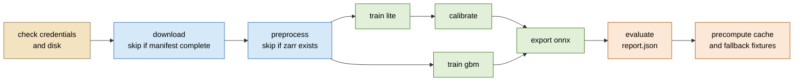
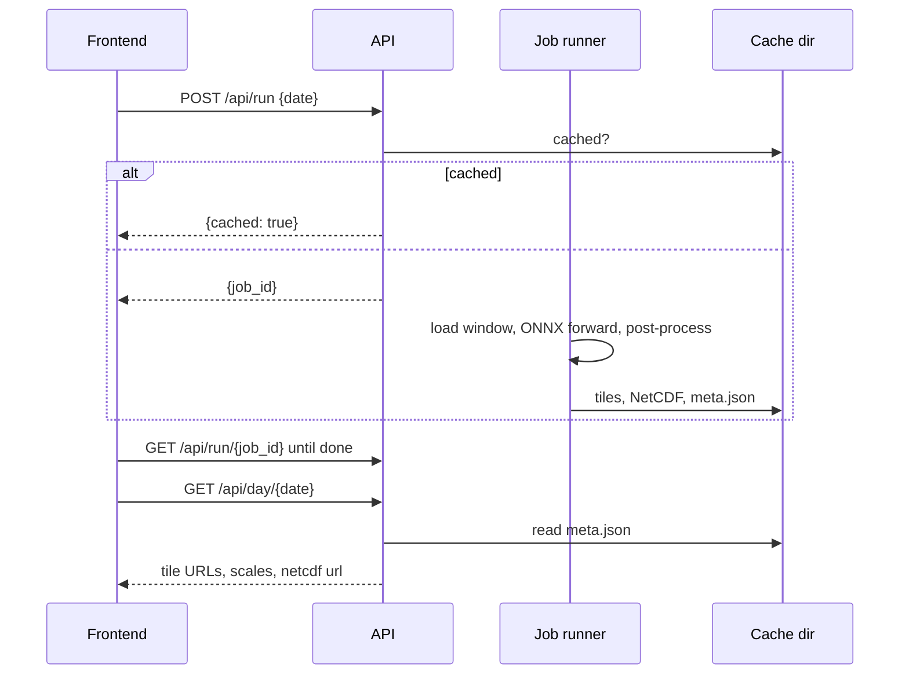

# Poseidon backend MVP: implementation spec

Temporary approval document. Deleted once the backend ships; durable decisions move into
`poseidon_backend_spec.md`.

## Feature request brief

Today the repository has a frontend landing page and two design documents, but no backend.
Nothing downloads ocean data, nothing trains a model, and no API answers the frontend's requests.
The frontend cannot progress past an "unavailable" scaffold because it has no payloads, no tiles,
and no report to render.

This work builds the whole backend described in the technical spec as a reliable MVP: a data
pipeline that produces the training dataset, two trained models (a gradient-boosted baseline and
the small neural network), an evaluation report that compares them, and a FastAPI service that
serves reconstructions, profiles, sections and downloads to the frontend. One command runs the
whole chain from raw downloads to a populated cache. The large "full" neural network is designed
for later and is not built here.

## Functional requirements

Data pipeline
- Download the five surface products and the GLORYS reanalysis for the North Indian Ocean box, for a
  configurable year range, resuming safely when re-run and staying within the laptop's disk.
- Quality-control, regrid to the 0.25 degree grid without mixing land into ocean cells, align all
  products to one daily calendar, and derive wet, seafloor and per-day availability masks.
- Interpolate the reanalysis to fifteen standard depths, assign train / dev / calibration / test
  splits by year with an eight-day purge at each boundary, fit the harmonic climatology on training
  years only, and normalise with training statistics only.
- Write one Zarr store with the schema in the technical spec, plus an Argo matchup table.
- Generate a synthetic dataset with the same schema, any grid size and date range, and no network
  access, so every downstream stage can be exercised without credentials.

Models
- Train the gradient-boosted baseline: fifteen regressors on the 24-column feature table.
- Train the lite neural network on Apple MPS with the architecture, loss and optimiser in the
  technical spec, checkpointing and evaluating on the dev year at a fixed cadence.
- Calibrate the neural network's uncertainty on the calibration year, one scale per depth.
- Export the neural network to ONNX with dynamic height and width, verified against PyTorch, and
  the baseline to its native booster files. Every export carries a model card.
- Evaluate climatology, baseline and lite with one harness on the test years and write the report.

API
- Serve every route in the technical spec with the response shapes in the frontend spec.
- Run inference in a background job with staged progress, cache results per date, and serve tiles
  and NetCDF files statically from the cache.
- Answer profile and section queries from cached fields, attaching the nearest Argo profile and
  the derived isotherm and mixed-layer depths.
- Provide a mock server that serves the same routes from bundled fixture files with fake delays.

Orchestration
- One script runs download, preprocessing, both trainings, calibration, export, evaluation and
  cache precompute in order, skipping stages whose outputs already exist, and stopping early with a
  clear message when credentials are missing.

## Non functional requirements

- Every stage runs end to end on the synthetic dataset in under five minutes on the M4 laptop.
- The full test suite runs offline in under three minutes and needs no downloaded data.
- The API never trains and never writes to the artifact directory.
- Inference for one day on the full grid completes in under two seconds on CPU for lite.
- Environment is reproducible from one lock file with `uv`; no conda, no system libraries beyond
  what Homebrew Python already provides.
- Errors reaching the frontend follow the agreed `{error, detail}` shape and never leak tracebacks.

## Scope

In
- Everything in the functional requirements above, for the lite year range 2014 to 2020.
- Synthetic data path and a test suite built on it.
- Makefile targets and the one-shot runner script.
- Dockerfile for the API.

Deferred
- The full neural network: architecture, training, and its extra NetCDF variables. The ONNX
  contract and the config layout leave room for it; nothing else needs to change when it lands.
- Quantile boosters for baseline uncertainty.
- Running the lite pipeline on the 1993 to 2020 full year range. The code supports it; the run is
  not part of this delivery.
- Running the official CF compliance checker in CI. It needs a system UDUNITS library. The test
  suite checks the required attributes directly; the checker is a Makefile target run by hand.

Out

| Not doing | Why |
|---|---|
| Conservative regridding with xesmf | Needs ESMF from conda; masked block means and bilinear resampling are within the noise of an MVP at 0.25 degrees |
| INCOIS gridded cross-check | Second validation source adds a download dependency for a coarse check nobody will act on in the MVP |
| Multi-process job queue | Single-process in-memory jobs are what the demo needs; a queue is a production concern |
| Authentication on the API | Demo deployment sits behind the frontend; no user data |
| GPU code paths other than MPS and CPU | No CUDA hardware in this delivery; the full model's GPU run is deferred with it |

## Process flow diagrams

The one-shot runner:

With `--synthetic` the first two boxes are replaced by the generator and the whole chain finishes in
minutes. That is the path the tests and the mock fixtures use.

Serving one reconstruction:

## Exact planned changes

All new code lives under `backend/`. The frontend is not touched. Existing docs are edited only
where the delivery changes a stated decision.

### PR 1: scaffold, contract and static services

| File | Change |
|---|---|
| `backend/pyproject.toml`, `uv.lock`, `Makefile`, `Dockerfile`, `.gitignore` | Project skeleton, Python 3.12, pinned deps, targets from the technical spec |
| `backend/app/main.py`, `config.py`, `deps.py` | App factory, lifespan, settings from environment |
| `backend/app/schemas/*.py` | Pydantic models matching the frontend JSON examples exactly |
| `backend/app/routers/*.py` | All routes, wired to service interfaces |
| `backend/app/services/tiles.py`, `derived.py`, `cache.py`, `jobs.py` | Array to PNG, D20/D26/MLD, cache layout, in-memory job registry |
| `backend/scales.json` and a generator script | Frozen colour scales, 256 stops per mode |
| `backend/mock.py`, `backend/fixtures/` | Mock server and placeholder fixtures, replaced by synthetic outputs in PR 4 |
| `backend/tests/` | Route, tile, derived-quantity and job tests |

Blast radius: 0 existing files changed, ~25 new files, 0 frontend files.

### PR 2: data pipeline

| File | Change |
|---|---|
| `backend/pipeline/sources.py` | Dataset ids, variable names, bounding box, margin; one place to change a product |
| `backend/pipeline/download.py` | Copernicus subset and PO.DAAC downloads with a manifest for resume; global files cropped on arrival; reanalysis streamed per month through regrid |
| `backend/pipeline/qc.py`, `regrid.py`, `align.py`, `masks.py`, `target.py` | Product checks, masked regrid, daily alignment, masks, depth interpolation |
| `backend/pipeline/split.py`, `climatology.py`, `normalise.py`, `zarr_writer.py` | Splits with purge, harmonic fit, statistics, store writer |
| `backend/pipeline/argo_matchups.py` | GDAC profiles to standard depths and nearest cell |
| `backend/pipeline/synthetic.py` | Schema-identical generator for any grid and date range |
| `backend/pipeline/run.py` | Command-line entry that chains the stages |
| `backend/tests/` | Tests for every stage on the synthetic generator; schema conformance of the store |

Blast radius: 0 existing files changed, ~15 new files.

### PR 3: models, export and evaluation

| File | Change |
|---|---|
| `backend/model/dataset.py` | Window builder, tiler, sampler, loss mask |
| `backend/model/lite.py`, `losses.py` | Lite network and the masked Gaussian plus vertical-gradient loss |
| `backend/model/train_nn.py`, `train_gbm.py` | Training loops, checkpoints, dev evaluation |
| `backend/model/calibrate.py`, `export.py` | Per-depth sigma scaling, ONNX and booster export, model card |
| `backend/model/features.py` | The 24-column feature table shared by training and serving |
| `backend/eval/evaluate.py`, `metrics.py` | One harness, all metrics in the technical spec, report writer |
| `backend/configs/lite.yaml`, `gbm.yaml`, `tiny.yaml` | Real configs plus a tiny one for tests |
| `backend/tests/` | Tiny training run, ONNX parity, feature table shape, metric unit tests |

Blast radius: 0 existing files changed, ~14 new files.

### PR 4: inference, serving, precompute, one-shot runner

| File | Change |
|---|---|
| `backend/app/services/inference.py`, `gbm.py`, `netcdf.py`, `argo.py`, `section.py` | Live services replacing the PR 1 interfaces |
| `backend/eval/precompute.py` | Cache every test day, write report tiles, copy fallback fixtures |
| `backend/scripts/run_all.py` | The one-shot runner with stage skipping and `--synthetic` |
| `backend/fixtures/` | Regenerated from the synthetic run, labelled as synthetic |
| `backend/tests/` | End-to-end: synthetic store, tiny model, API round trip, NetCDF attributes |
| `docs/poseidon_backend_spec.md` | Regrid method, product list, default model, contract field names updated to match |
| `docs/product-and-frontend-roadmap.md` | Fallback and schema rows updated to point at the delivered artifacts |

Blast radius: 2 existing docs changed, ~10 new files, 0 frontend files.

## Decisions that differ from the technical spec

- Default model is `lite`, not `full`, because only lite is trained in this delivery.
- Regridding uses masked block means for finer sources and bilinear resampling for sources
  already at 0.25 degrees. The conservative xesmf path is dropped.
- Sources follow the problem statement's recommended list: OSTIA, SMAP/SMOS salinity, DUACS and
  GLORYS from Copernicus Marine; OSCAR currents and CCMP winds from NASA PO.DAAC. Two free
  logins are needed, one per service. Copernicus downloads are subset server-side; PO.DAAC files
  are global, so each is cropped to the box on arrival and the global file deleted.
- The reanalysis is downloaded one month at a time, regridded immediately and the raw month deleted,
  because the raw 1/12 degree files for seven years would not fit on the laptop's disk.
- Downloads need a Copernicus Marine account and a NASA Earthdata account the user creates
  once; the runner checks for both and stops with instructions if either is missing. Argo profiles
  are open and need no login.
- Profile response fields follow the frontend spec (`poseidon_mean`, `poseidon_p10`,
  `poseidon_p90`) and the inputs key is `wind`, because the frontend examples are the contract.
- Grid size and date range are read from the store, never hard-coded, so tests run on a small grid.
- The CF compliance checker is a manual target, not a CI test.

## Testing cases

| What is checked | Why it matters |
|---|---|
| Every route returns the documented shape and status codes, including all error codes | The frontend is built against these shapes |
| Tiles: land transparent, NaN handled, values round-trip through the colour scale within one step | Tiles are the main visual output |
| D20, D26, MLD on hand-built profiles including no-crossing cases | Derived numbers appear on screen unqualified |
| Synthetic store conforms to the schema table: names, shapes, dtypes, attrs | Every later stage assumes it |
| Splits: purge days marked, no training day within eight days of a dev or test day | Leakage would invalidate the whole comparison |
| Climatology fitted on train days only reproduces a planted seasonal cycle | Anomalies are the model target |
| Normalisation statistics computed from train days only | Same leakage concern |
| Window builder fills missing days with zeros and mask zero | Inference at range edges must not crash |
| Tiny lite training runs, loss decreases, checkpoint and model card written | Proves the loop end to end |
| ONNX output matches PyTorch within 1e-4 on several tiles | The API serves the ONNX file |
| Baseline features have 24 columns and train fifteen boosters | Baseline is the comparison the pitch rests on |
| Metrics on known inputs give known values; skill score and coverage edge cases | Report numbers are the headline evidence |
| Full run on synthetic data through the API: run, poll, day, profile, section, download | The single most important guarantee of the delivery |
| NetCDF carries every required variable and attribute from the technical spec | Compliance is a stated deliverable |
| Job registry: eviction, concurrency limit, error state with sanitised message | Reliability under repeated demo clicks |
