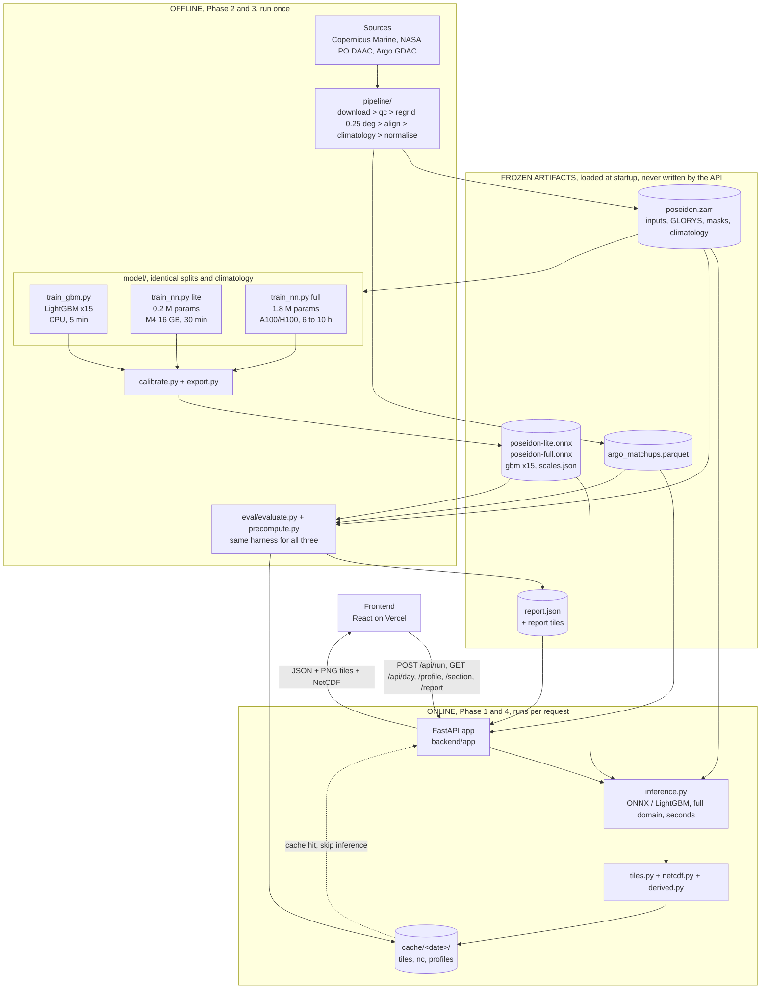
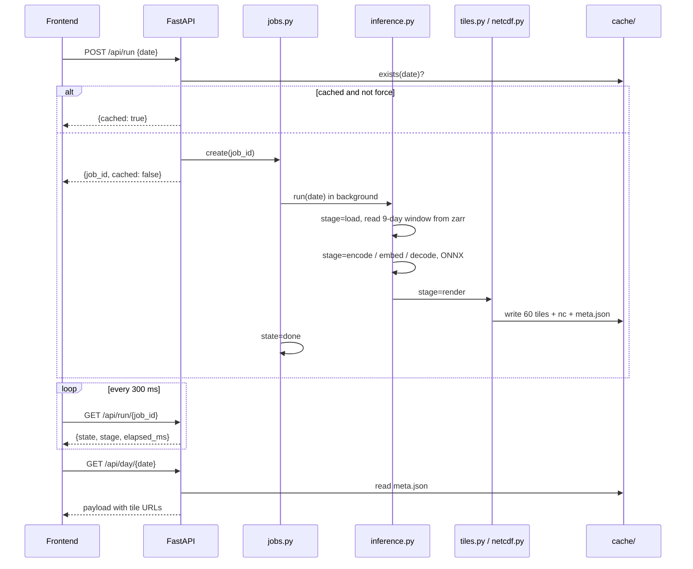
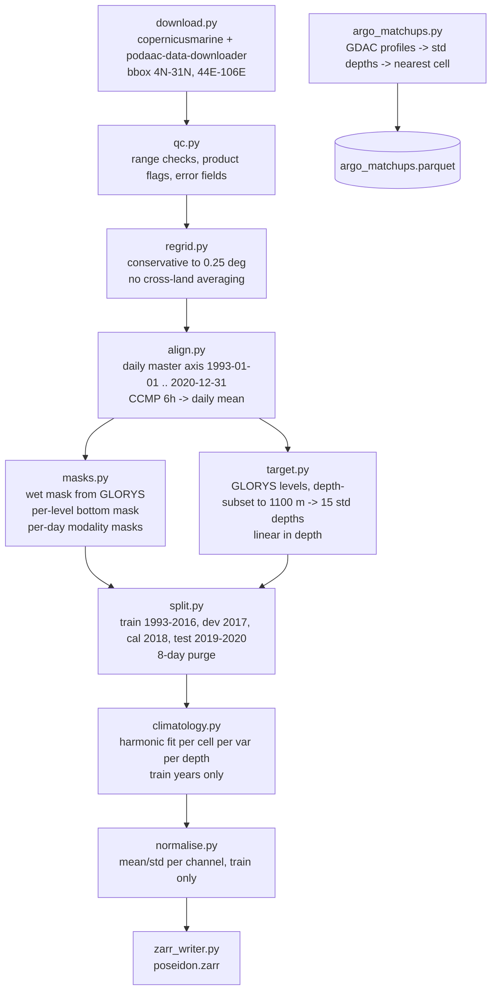
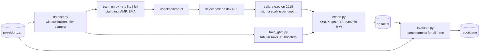
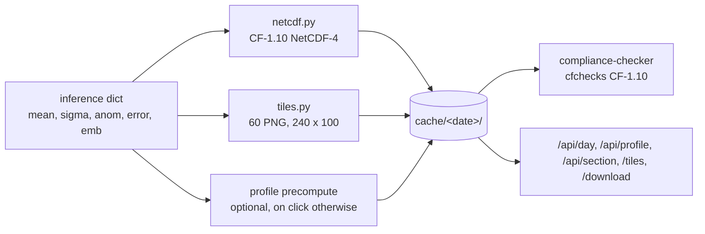

# Poseidon Backend Technical Specification

Version 0.1 | SIH 2026 | PS SIH26066
Companion docs: `poseidon_project_guide.md`, `poseidon_frontend_spec.md`

Phases
1. FastAPI scaffolding
2. Preprocessing
3. Training and inference (poseidon-gbm, poseidon-lite, poseidon-full)
4. Output compliance and frontend contract

---

## 0. Overall architecture

Read top to bottom: what runs live is at the top, what runs once offline is below.



Runtime rule: the API never trains. It loads frozen artifacts at startup and only runs inference.

---

## Phase 1: FastAPI scaffolding

### 1.1 Layout

```
backend/
  app/
    main.py            create_app(), lifespan, CORS, static mounts
    config.py          pydantic-settings, env-driven
    deps.py            singletons: model, zarr handle, argo index
    routers/
      meta.py  report.py  run.py  day.py  profile.py  section.py  health.py
    services/
      inference.py     ONNX session, window builder, de-normalise, add climatology
      gbm.py           LightGBM predict for comparison mode
      tiles.py         array -> PNG via scales.json
      netcdf.py        CF writer
      argo.py          nearest matchup lookup
      section.py       line sampling + depth interpolation
      derived.py       D20, D26, MLD from a profile
      cache.py         cache/<date>/ read, write, exists
      jobs.py          in-memory job registry, background runner
    schemas/           pydantic response models, one file per router
  mock.py              same routes, serves fallback fixtures, fake stage delays
  scales.json          shared with frontend
  tests/
  pyproject.toml
  Dockerfile
```

### 1.2 Config (`config.py`)

| Env var | Default | Purpose |
|---|---|---|
| `POSEIDON_DATA_DIR` | `./data` | zarr, parquet, report, cache |
| `POSEIDON_ART_DIR` | `./artifacts` | onnx, gbm, scales, model cards |
| `POSEIDON_MODEL` | `lite` | `lite`, `full`; `lite` is the only model trained in this delivery |
| `POSEIDON_ENABLE_GBM` | `true` | serve gbm as comparison layer |
| `POSEIDON_DEVICE` | `cpu` | onnxruntime provider: `cpu`, `cuda`, `coreml` |
| `POSEIDON_CORS_ORIGINS` | `*` | comma list |
| `POSEIDON_TEST_RANGE` | `2019-01-01,2020-12-31` | date picker bounds |
| `POSEIDON_MAX_JOBS` | `2` | concurrent runs |

### 1.3 Startup (lifespan)

1. Load `scales.json`, `model_card.json`.
2. Open `poseidon.zarr` read-only (lazy, xarray + zarr).
3. Load climatology and normalisation stats into RAM (~60 MB).
4. Create onnxruntime session for the selected NN; load LightGBM boosters if enabled.
5. Load Argo matchup parquet into a KD-tree keyed by (date, lat, lon).
6. Warm up: run one cached day through inference to JIT kernels.
7. Register `GET /healthz` returning model version and data ranges.

### 1.4 Routes

| Method | Path | Handler | Notes |
|---|---|---|---|
| GET | `/healthz` | health | 200 with versions |
| GET | `/api/meta` | meta | static from card + config |
| GET | `/api/report` | report | serves `report.json`, gzip |
| POST | `/api/run` | run.start | body `{date, force, model?}` |
| GET | `/api/run/{job_id}` | run.status | 404 if unknown |
| GET | `/api/day/{date}` | day.get | 404 if not cached; 422 if outside test range |
| GET | `/api/profile` | profile.get | query `d, lat, lon, model?` |
| GET | `/api/section` | section.get | query `d, a, b, n, model?` |
| GET | `/tiles/{path}` | static | mount to `cache/` |
| GET | `/download/{file}` | static | NetCDF files |

`model` query param defaults to the configured NN; `gbm` selects the baseline so the frontend can show side-by-side.

### 1.5 Job flow



Job registry: `dict[job_id, Job]`, single process, `asyncio.to_thread` for inference. Evict jobs older than 10 min. Return 429 if `MAX_JOBS` reached.

### 1.6 Errors

All errors: `{"error": str, "detail": str | null}`. Codes: 400 bad date, 404 unknown job or uncached day, 422 out of range or land cell, 429 busy, 500 inference failure (logged with traceback, message sanitised).

### 1.7 Tests

- `tests/test_routes.py` against `mock.py` fixtures.
- `tests/test_tiles.py`: array to PNG round-trip, land transparency, NaN handling.
- `tests/test_netcdf.py`: file passes `compliance-checker` CF-1.10.
- `tests/test_inference.py`: one cached day matches stored output within 1e-4.

---

## Phase 2: Preprocessing

### 2.1 Flow



### 2.2 Grid

- Cell centres: lat 5.125 .. 29.875 (100), lon 45.125 .. 104.875 (240).
- Download with a 1 deg margin, regrid, then crop. Margin avoids edge artefacts.
- Regridding: masked block means for finer-than-target sources (OSTIA, SSS, DUACS at 0.125 deg); bilinear resampling for sources already on a 0.25 deg grid, from whole-quarter-degree centres to the target's x.125 cell centres (GLORYS, OSCAR, CCMP). The conservative `xesmf` path was dropped. Land cells are excluded from source averages (mask before regrid) so coastal cells are not contaminated.
- GLORYS: the 0.25 deg ensemble-mean member `cmems_mod_glo_phy-all_my_0.25deg_P1D-m`, variable `thetao_glor`, depth-subset to 1100 m before regridding. Switched from the native 1/12 deg `thetao` product because that transfer was ~100 GB for this bbox and period.

### 2.3 Zarr schema (`data/poseidon.zarr`)

| Array | Shape | dtype | Notes |
|---|---|---|---|
| `time` | (T,) | datetime64 | T = 10227 days |
| `lat`, `lon` | (100,), (240,) | float32 | |
| `depth` | (15,) | float32 | standard depths |
| `x` | (T, 7, 100, 240) | float16 | normalised anomalies: sst, sss, sla, cur_u, cur_v, wnd_u, wnd_v |
| `x_mask` | (T, 5, 100, 240) | uint8 | 1 = valid: sst, sss, sla, cur, wnd |
| `y` | (T, 15, 100, 240) | float16 | normalised GLORYS anomaly |
| `y_raw` | (T, 15, 100, 240) | float16 | absolute deg C, used by API and eval only |
| `wet` | (100, 240) | uint8 | ocean mask |
| `bottom` | (15, 100, 240) | uint8 | 1 = above seafloor |
| `static` | (3, 100, 240) | float32 | wet, normalised depth, coast distance |
| `split` | (T,) | uint8 | 0 train, 1 dev, 2 cal, 3 test, 255 purged |
| `clim_x` | (366, 7, 100, 240) | float16 | daily climatology, inputs |
| `clim_y` | (366, 15, 100, 240) | float16 | daily climatology, target |
| `norm` | attrs | json | mean/std per channel and depth |

Chunks: `(32, all, 100, 240)` on time. Size: `x` 7 GB, `y` and `y_raw` 7 GB each, clim 0.5 GB. Total ~22 GB. Lite subset (`--years 2016-2020`) ~4 GB.

### 2.4 Climatology

Per cell, per variable, per depth, fit on training days only:

`c(doy) = a0 + a1 cos(2 pi doy/365.25) + b1 sin(...) + a2 cos(4 pi doy/365.25) + b2 sin(...)`

Five coefficients, least squares. Evaluate for 366 days, store as `clim_*`. Anomaly = raw minus `clim`. Same climatology for all models, including GBM.

### 2.5 Argo matchups

- Source: Argo GDAC profiles (QC flag 1 or 2) in the box, 2019 to 2020, plus INCOIS gridded product for a coarse cross-check.
- Interpolate each profile to the 15 standard depths (linear, require samples within 10 m above and below, else NaN).
- Attach nearest grid cell, date, distance to cell centre, float WMO.
- Output parquet: `date, wmo, lat, lon, cell_i, cell_j, dist_km, t_0 .. t_1000`.
- Expected count: ~3,000 to 5,000 profiles over two years in this region.

### 2.6 Timing (8-core laptop, 1 Gbps)

| Step | Full 1993-2020 | Lite 2016-2020 |
|---|---|---|
| Download | 6 to 12 h (bandwidth bound, ~60 GB raw) | 2 to 3 h |
| Regrid + align | 2 to 3 h | 40 min |
| Climatology + normalise | 20 min | 5 min |
| Zarr write | 30 min | 10 min |
| Argo matchups | 15 min | 15 min |

Run once. Everything after reads the Zarr.

---

## Phase 3: Training and inference

Three models, one evaluation harness, identical splits and climatology.

| Model | Type | Params | Input window | Hardware | Train time | Role |
|---|---|---|---|---|---|---|
| `poseidon-gbm` | LightGBM, 15 regressors | ~15 x 500 trees | day t | 8-core CPU | 5 min (lite rows), 60 to 90 min (full rows) | conventional-ML baseline |
| `poseidon-lite` | CNN encoder + depth-attention decoder | ~0.2 M | t-2 .. t | Mac M4 16 GB, MPS | 25 to 30 min | prototype, proves NN beats GBM |
| `poseidon-full` | multi-stem CNN + causal Transformer + depth attention | ~1.8 M | t-8 .. t | 1x A100/H100 80 GB | 6 to 10 h | final |

### 3.1 Training flow



### 3.2 Dataset and sampling (`dataset.py`)

- Window builder: for day t returns `x[t-k+1 .. t]` stacked to `(k, 12, H, W)` where 12 = 7 fields + 5 masks. Missing days in the window get zeros with mask 0.
- Tiler: full domain `100 x 240` split into overlapping tiles; loss on the central core only.
- Sampler: uniform over training days, tiles weighted by wet fraction (skip tiles with < 20% ocean).
- Loss mask: `wet & bottom & ~purged`.

| | lite | full |
|---|---|---|
| tile / core | 64 / 48 | 96 / 80 |
| tiles per day | 15 | 12 |
| window k | 3 | 9 |
| in-RAM | yes, fp16 numpy (~0.7 GB for 2016) | zarr streaming, 8 workers |

### 3.3 poseidon-gbm

Purpose: the "conventional ML" the PS says embeddings should beat. Make it strong, not a straw man.

Features per (day, cell), 24 columns:
- 7 fields at t (anomalies), 5 masks
- 3x3 neighbourhood mean of sla and sst, SLA gradient magnitude, wind stress curl proxy (finite difference of wind)
- lat, lon, sin/cos doy, water depth, coast distance

Target: normalised GLORYS anomaly at each of 15 depths, one booster each.

| | lite rows | full rows |
|---|---|---|
| Training days | 2016 | 1993-2016 |
| Row subsample | 2 M random ocean cells | 12 M |
| Trees / leaves / lr | 500 / 63 / 0.05 | 1200 / 127 / 0.03 |
| Time, 8-core CPU | ~20 s per depth, 5 min total | ~5 min per depth, 75 min total |
| GPU option | XGBoost `gpu_hist`, 10 min | 15 min |

Inference full domain: 15 boosters x 15,600 cells, ~1 s CPU. No uncertainty (report as N/A in calibration tables; optional quantile boosters for p10/p90 if time allows).

### 3.4 poseidon-lite

```mermaid
flowchart LR
  IN["x window<br/>3 x 12 x 64 x 64"] --> CAT["concat time to channels<br/>36 x 64 x 64"]
  CAT --> E1["conv 3x3 -> 32, GN, SiLU"]
  E1 --> E2["ResBlock 32, x2"]
  E2 --> D1["down 2x -> 64, ResBlock x2"]
  D1 --> D2["down 2x -> 96, ResBlock x2"]
  D2 --> EMB["1x1 -> 32-D embedding<br/>at 16 x 16"]
  EMB --> U1["up 2x + skip -> 64"]
  U1 --> U2["up 2x + skip -> 48"]
  U2 --> ST["concat static 3 -> 51"]
  ST --> DQ["15 depth queries<br/>1 cross-attn block, d=48, 4 heads"]
  DQ --> HD["per-depth head:<br/>mean, log-sigma"]
```



- Params ~0.2 M. Embedding 32-D at 1 deg spacing, exportable.
- Loss: masked Gaussian NLL (diagonal) + 0.3 x Huber on vertical differences `T[z+1]-T[z]` vs target. Depth weights 1.5 on 50 to 200 m.
- Optim: AdamW lr 2e-3, cosine, weight decay 1e-4, batch 32, AMP off on MPS (bf16 flaky), EMA 0.999.
- Budget: 10,000 steps. On M4 MPS ~0.12 to 0.15 s/step with in-RAM data: 20 to 25 min. Dev eval every 1,000 steps on 2017 (200 random tiles, 10 s).
- Memory: ~3 GB peak.
- Expected result vs gbm on test: lower RMSE at 50 to 200 m, higher anomaly correlation, smoother spatial fields; roughly equal at 0 to 20 m; loss still descending at 10k steps (this is the "signal": show the curve).

`configs/lite.yaml`
```yaml
model: lite
years_train: [2016, 2016]
window: 3
tile: 64
core: 48
batch: 32
steps: 10000
lr: 2e-3
emb_dim: 32
width: [32, 64, 96]
depth_attn_blocks: 1
loss: {nll: 1.0, vgrad: 0.3, thermocline_w: 1.5}
device: mps
in_ram: true
eval_every: 1000
```

### 3.5 poseidon-full

```mermaid
flowchart LR
  IN["x window 9 x 12 x 96 x 96"] --> SP["split by modality<br/>sst, sss, sla, cur, wnd"]
  SP --> S1["5 CNN stems<br/>masked conv, GN, SiLU, ResBlock x2<br/>shared over 9 days<br/>64-D at 48 x 48"]
  S1 --> MF["masked modality fusion<br/>attn over 5 tokens + reliability gate"]
  MF --> TT["causal Transformer over 9 days<br/>2 blocks, d=64, 4 heads, FFN 128"]
  TT --> ZS["Z_sat: 64-D embedding<br/>target day, 48 x 48"]
  ZS --> SD["dilated ResBlocks x3<br/>bilinear 2x + high-res skip from day t"]
  SD --> STC["concat static -> 96-D latent"]
  STC --> DT["15 depth tokens<br/>2 depth self-attn blocks, d=96"]
  DT --> HD["head: mean, log-sigma,<br/>3 low-rank factors"]
```



- Params ~1.8 M. Embedding 64-D at 0.5 deg, exportable as `embedding` variable.
- Loss: masked multivariate Gaussian NLL with `Sigma = diag(s^2) + F F^T`, F is 15x3; plus 0.3 x vertical-gradient Huber; thermocline weight 1.5. Modality dropout p=0.1 per stem during training.
- Optim: AdamW lr 1e-3, cosine with 2k warmup, wd 1e-4, batch 8 per GPU, bf16 AMP, EMA 0.9995, grad clip 1.0.
- Data: 1993-2016, ~8,766 days x 12 tiles = ~105k tiles/epoch, 13k steps/epoch.
- Budget: 25 epochs, ~330k steps.

| GPU | step time | wall |
|---|---|---|
| H100 80 GB | ~55 ms (dataloader bound) | ~5 h |
| A100 80 GB | ~70 ms | ~6.5 h |
| RTX 4090 24 GB | ~110 ms, batch 6 | ~12 h |
| 2x A100 DDP | ~40 ms effective | ~4 h |

Dev eval every epoch on all 2017 days, full domain, ~3 min. Early stop patience 5 epochs on dev NLL.

`configs/full.yaml`
```yaml
model: full
years_train: [1993, 2016]
window: 9
tile: 96
core: 80
batch: 8
epochs: 25
lr: 1e-3
warmup: 2000
emb_dim: 64
stem_width: 64
temporal_blocks: 2
depth_attn_blocks: 2
lowrank: 3
modality_dropout: 0.1
loss: {nll: 1.0, vgrad: 0.3, thermocline_w: 1.5}
precision: bf16
workers: 8
```

### 3.6 Calibration (`calibrate.py`)

On 2018 (never trained on), fit one scalar per depth `alpha_z` so that empirical 90% coverage matches nominal: `sigma_z <- alpha_z * sigma_z`. Store in `model_card.json`. Applied at inference. GBM skipped.

### 3.7 Export

- NN: `torch.onnx.export`, opset 17, dynamic H and W, inputs `x (1,k,12,H,W)`, `static (1,3,H,W)`; outputs `mean (1,15,H,W)`, `sigma`, `factors (1,15,3,H,W)` (full only), `embedding`. Verify ONNX vs PyTorch max abs diff < 1e-4 on 10 tiles.
- GBM: `booster.save_model()` x15 plus feature spec json.
- Every artifact carries `model_card.json`: name, git sha, config hash, data hash, train years, steps, dev metrics, calibration alphas.

### 3.8 Inference (`inference.py`)

```mermaid
sequenceDiagram
  participant R as run(date)
  participant Z as zarr
  participant M as ONNX / GBM
  participant P as post
  R->>Z: read x[t-k+1..t], x_mask, static, clim_y[doy], norm
  R->>M: full-domain forward, 100 x 240, single pass
  M-->>R: mean_n, sigma_n, factors, embedding
  R->>P: de-normalise, add clim_y -> deg C
  P->>P: apply wet and bottom masks -> NaN
  P->>P: anomaly = mean - clim_y ; error = mean - y_raw (test days only)
  P-->>R: dict of arrays (15,100,240) per mode + embedding
```

The per-depth calibration alphas from `calibrate.py` are baked into the exported ONNX graph
(see `model/export.py`'s `ExportWrapper`), so the ONNX sigma output is already calibrated and
`inference.py` never re-scales it.

Latency, full domain:

| Model | CPU 8-core | M4 MPS/CoreML | GPU |
|---|---|---|---|
| gbm | 1.0 s | 0.8 s | n/a |
| lite | 0.4 s | 0.15 s | 0.05 s |
| full | 2.5 to 4 s | 1.0 s | 0.15 s |

Tiling for inference is not needed; the convnets are fully convolutional and 100 x 240 fits in memory. Pad to multiples of 8.

### 3.9 Comparison protocol (`evaluate.py`)

Same function for all three. Test days 2019-2020, ocean cells only, all at once.

Metrics, each reported per depth, per basin (BoB, AS), per season (DJF, MAM, JJAS, ON), plus overall:
- RMSE, MAE, bias, Pearson r on absolute temperature
- anomaly correlation (vs climatology) and climatology skill score `1 - MSE_model / MSE_clim`
- thermocline band RMSE (50 to 200 m pooled), D20 RMSE, D26 RMSE, MLD RMSE
- vertical gradient RMSE (`dT/dz` between adjacent levels)
- spatial structure: ratio of predicted to true power at 1 to 3 deg wavelengths from 2D FFT of the 100 m anomaly field (GBM tends to be blocky; NN should be closer to 1)
- Argo: RMSE, bias, r at matchups for model and for GLORYS
- uncertainty (NN only): NLL, CRPS, coverage at 50/80/90/95, mean interval width
- learning curve (NN only): dev RMSE at 100 m vs training steps, from checkpoints

Output `report.json` with series for `climatology, gbm, lite, full` (and `unet, convlstm` if trained). Headline table also in `report.md`.

Pass criteria for the prototype claim: `lite` beats `gbm` on thermocline-band RMSE and anomaly correlation on the test set, with the lite learning curve still improving. Everything else is reported as measured.

---

## Phase 4: Output compliance and frontend contract

### 4.1 Flow



### 4.2 NetCDF (`poseidon_<model>_<date>.nc`)

- Format: NetCDF-4, zlib level 4, chunks `(1, 15, 100, 240)`.
- Dimensions: `time(1), depth(15), latitude(100), longitude(240)`, plus `embedding_dim(64), lat_emb(50), lon_emb(120)` for full.
- Variables:

| Name | Dims | Attrs |
|---|---|---|
| `thetao` | time, depth, lat, lon | standard_name `sea_water_potential_temperature`, units `degC`, `_FillValue` NaN, `cell_methods "time: mean"` |
| `thetao_std` | same | long_name `predictive standard deviation`, units `degC` |
| `thetao_p10`, `thetao_p90` | same | units `degC` |
| `thetao_anomaly` | same | long_name `anomaly relative to 1993-2016 harmonic climatology` |
| `prediction_status` | depth, lat, lon | flag_values 0,1,2 ; flag_meanings `valid land below_seafloor` |
| `ood_score` | lat, lon | 0 to 1, distance of embedding from training manifold (full only) |
| `embedding` | time, embedding_dim, lat_emb, lon_emb | full only |
| `depth` | depth | positive `down`, units `m`, axis Z |

- Global attrs: `Conventions "CF-1.10"`, `title`, `institution`, `source` (product names and versions), `model_name`, `model_version`, `git_sha`, `config_hash`, `data_hash`, `calibration_alphas`, `training_period`, `test_period`, `history`, `references`, `geospatial_*_min/max`, `time_coverage_*`.
- Test: `compliance-checker --test cf:1.10` must return 0 errors; warnings allowed and listed.

### 4.3 Tiles

- 240 x 100 RGBA PNG, one pixel per cell, no interpolation.
- Colour from `scales.json`: `{mode: {cmap, vmin, vmax}}`; `cmap` is 256 RGB stops. Land alpha 0. Below-seafloor: an opaque two-tone grey diagonal hatch, one pixel per cell (no PNG-level pattern tiling).
- Paths: `cache/<date>/<model>/{mean,sigma,anom,error}/z{00..14}.png`, inputs at `cache/<date>/in/{sst,sss,sla,cur,wind}_t{-8..0}.png`.
- `meta.json` per date: runtime, model card ref, per-mode ranges, per-depth ranges, tile list, nc filename.

### 4.4 Response schemas (pydantic, summarised)

| Schema | Key fields |
|---|---|
| `Meta` | model_version, checkpoint, test_range, depths_m, grid, curated_days, cached_days, models_available |
| `Report` | headline, by_depth{model}{metric}{basin}{season}[15], maps{depth}{rmse,bias}: tile url, argo_scatter, calibration, tables, learning_curve |
| `RunStart` | job_id, cached |
| `RunStatus` | state, stage, elapsed_ms, message |
| `Day` | date, model, cached_at, runtime_ms, inputs{var: tile, range, missing_fraction, history[]} keyed by `sst, sss, sla, cur, wind`, layers{mode: [15 urls]}, scales, per_depth_scales, netcdf_url |
| `Profile` | lat, lon, depths_m, poseidon_mean, poseidon_p10, poseidon_p90, glorys, gbm (optional), argo or null, scalars{d20_m, d26_m, mld_m, rmse_glorys, rmse_argo} |
| `Section` | distances_km, lats, lons, depths_m, model[n][15], glorys, sigma, d20_m[n], mld_m[n], argo_markers |

Full JSON examples live in `poseidon_frontend_spec.md` section 11 and are the single source of truth; pydantic models are generated to match.

### 4.5 Derived quantities (`derived.py`)

- D20, D26: linear interpolation of the profile to find the depth where T crosses 20 or 26 C; NaN if surface is colder than the isotherm.
- MLD: depth where T drops 0.2 C below the 10 m value (de Boyer Montegut 2004 criterion), linear interpolation between levels.
- Section sampling: `n` points along the straight lat/lon line, nearest cell per point, depth interpolation linear to 200 levels for the heatmap.

### 4.6 Report and cache precompute (`eval/precompute.py`)

- Runs every test day through inference for `full`, `lite`, `gbm`; writes cache and NetCDF.
- 731 days x 3 models x ~4 s = ~2.5 h on CPU, 15 min on GPU.
- Writes `report.json`, report map tiles, `report.md`.
- Copies 5 curated days plus 3 sections into `frontend/public/fallback/`.

### 4.7 Delivery checklist for the frontend

- [ ] `scales.json` frozen (week 1)
- [ ] `meta.json`, `report.json` with at least `climatology, gbm, lite` series (week 1)
- [ ] one full `day` payload with tiles from `lite` (week 1)
- [ ] `mock.py` serving the above (week 1)
- [ ] live API with `full` model and all test days cached (week 2)
- [ ] Argo matchups wired into `/api/profile` (week 2)
- [ ] NetCDF compliance test green in CI (week 2)

---

## Appendix A: repo commands

```
make data-lite        # download + preprocess 2016-2020
make data-full        # 1993-2020
make gbm CFG=lite     # 5 min
make nn CFG=lite      # ~25 min on M4
make nn CFG=full      # 6-10 h on A100
make calibrate MODEL=lite|full
make export MODEL=lite|full|gbm
make eval             # report.json, cache, fallback fixtures
make api              # uvicorn app.main:create_app --factory
make mock             # uvicorn mock:app
make test
make all               # scripts/run_all.py: data -> gbm -> nn -> calibrate -> export -> eval -> precompute
make all-synthetic     # same, on the no-network synthetic generator and configs/tiny.yaml
```

## Appendix B: known limits, stated in the model card

- GLORYS assimilates Argo; Argo validation is not fully independent. Both model and GLORYS are scored at identical matchups.
- 0.25 deg is the output grid, not the information resolution.
- Skill below 500 m is weak; sigma is wide there by construction.
- Equatorial edge (5 to 7 N) and coastal cells have larger errors; `ood_score` and `prediction_status` flag them.
- Jobs are in-memory, single process. Production would need a queue.
